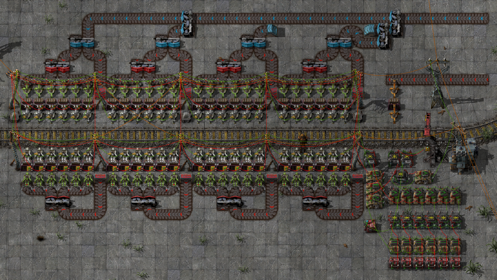

# GRUS component: Programmed loading station

This is a component of the [GRand Unified Storage system][grus]: a train
station that loads trains according to a per-train load order configuration.

- Blueprint version: 1
- Factorio version: 0.15.x

## Usage

The bottom row of `=` deciders and constant combinators is the load order
registry. Set the `T=` test on each decider to a chosen train ID, and set the
corresponding constant combinator to the types and amounts of items to load on
that train.  The station comes with 4 registers, i.e. 4 train slots, prebuilt;
if you need more, just use a blueprint to repeat the pattern onward to the
right.

When a train parks at the station, its ID will be looked up in the load order
registry. If some register matches the train ID, then the contents of the
corresponding constant combinator is output to the loading circuit. The circuit
computes the difference between the load order and the train inventory, then
masks that with what's available in the buffer chests, and sets the resulting
item types as the filter for the filter inserters. Thus you do not need to set
filters on your train cars to load different kinds of items, and the inserters
should not deadlock themselves since they should always be able to drop what
they hold if you make sure your load orders do not fill the train completely.

The station also sends a buffer request signal on the green wire to the large
electric pole. This signal indicates what the station needs more of to fill its
buffer chests. By default, this is 2 times the union of all the load orders -
this is what the lone constant combinator and upward pointing `>` deciders do.
The margin multiplier can be configured by setting the `B` signal on the lone
constant combinator. The output signal on the green wire can be connected to a
[GRUS storage unit][driver] to keep the station supplied with the items it
needs.

## Possible variations

- Instead of reading the load orders from locally programmed register, you
  could wire them up to other parts of the factory that order what they need.
  The train selection deciders would then choose a remote signal to read
  instead of a constant combinator.
- I would like to add a couple of "junk" output inserters, which would unload
  anything not in the load order and send it back to storage.

## Blueprint string

Available in the [blueprint book][book].

## Author

Blueprint design by by Emil "emlun" Lundberg. Licensed under [Creative Commons
Attribution-ShareAlike 4.0][cc].

[grus]: https://github.com/emlun/factorio-grus/
[driver]: storage-driver.md
[book]: blueprint-book.txt
[cc]: https://creativecommons.org/licenses/by-sa/4.0/
