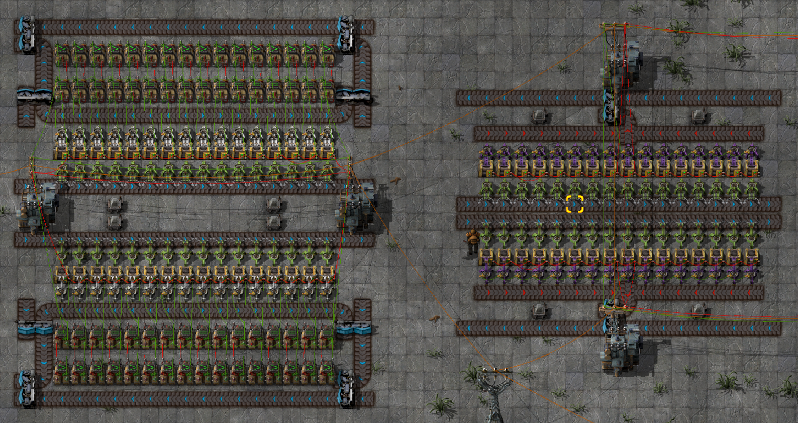

# GRUS component: Storage cell

This is a component of the [GRand Unified Storage system][grus]: a repeatable
storage cell using no requester or provider chests. Combine these with a
[storage driver][driver] to make a _storage unit_.

- Blueprint version: 1
- Factorio version: 0.15.x

## Variations

There are two designs of the storage cell. The standard design (left) is larger
and more expensive, but also faster because each output inserter will only set
its filter to items available in its chest. The compact design is cheaper and,
obviously, more compact, but slower because all output inserters in the entire
storage unit share the same filters. The compact design also requires an
additional pair of decider combinators to limit the output filter signal to the
kinds of items present in the storage cell. The [storage driver][driver]
provides such deciders, but is designed primarily for use with the standard
design.

Other than that, the two designs are functionally identical and use the same
I/O signals. They can even be used together in the same storage unit.

## Usage

Recommended usage is to connect a chain of storage cells to a [storage
driver][driver] to manage the I/O signals, but the cells can also be used
individually.

The belts between the chests are input belts. Connect these to any resource
input, and all incoming items will be stored in the chests. The red wire on the
substations tells the total inventory in the entire storage unit.

The belts on the outsides are output belts. Connect a green wire to one of the
substations and send the value `1` for each kind of item you want to withdraw
from storage. The output inserters will work as long as this signal persists.

## Caveats

- Because the cell does not count the items it outputs, it will almost always
  output more items than needed because of the latency as the items are
  delivered by the belts. You will need to ensure that the recipient system can
  handle a large amount of overshoot, for example by using a large input buffer
  and/or feeding excess back into the storage cell.
- The storage cell is not easily parallelizable, meaning throughput is limited
  to the two express belts. You could use multiple storage cells in parallel,
  but the GRUS storage driver does not support this as it would greatly
  complicate its output filter array.

## Blueprint string

Available in the [blueprint book][book].

## Author

Blueprint design by by Emil "emlun" Lundberg. Licensed under [Creative Commons
Attribution-ShareAlike 4.0][cc].

[grus]: https://github.com/emlun/factorio-grus/
[driver]: storage-driver.md
[book]: blueprint-book.txt
[cc]: https://creativecommons.org/licenses/by-sa/4.0/
