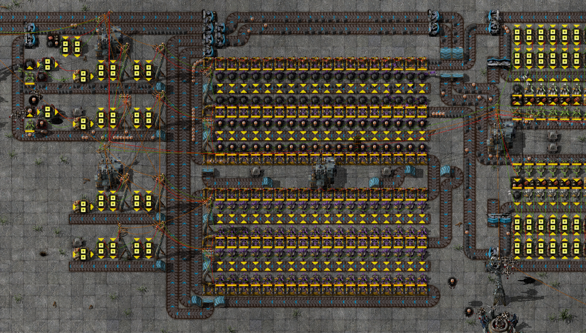

# GRUS component: Storage driver

This is a component of the [GRand Unified Storage system][grus]: an I/O
controller for use with one or more [storage cells][storage-cell]. The
combination of these two components makes a _storage unit_.

The storage driver:

- Sorts output onto multiple individually programmed output belts
- Limits excess output
- Can request additional items to be put into storage

- Blueprint version: 1
- Factorio version: 0.15.x

## Setup

Connect the driver to a [storage cell][storage-cell]. This gives you two input
belts and four output belts. The output belts can be programmed individually,
and take precedence from top to bottom.

## Programming

The storage driver can be programmed with what to output from the storage cells
and what to request for input.

### Output

Each output belt has a decider combinator facing right; connect an _output
request signal_ to this. Each item signal greater than 0 sent to this decider
will cause the storage unit to output that item on that output belt for as long
as the signal persists. Any excess left on the output belts from the storage
cells will be fed back into the storage cells.

One useful way to use this signal input is to input the difference between a
constant combinator and the contents of one or more chests. The output belt will
then be supplied with items to fill the chests with the item amounts set in the
constant combinator. The [GRUS programmed loading station][loading-station]
sends this kind of signal.

### Input

The storage unit can send an _input request signal_ counting additional items it
would like to store. Set some item amounts in the top constant combinator, and
the top substation will send a green signal containing the differences between
the configured amounts and the amount stored in the storage unit. This signal
can be connected to a [GRUS programmed unloading station][unloading-station] to
make the station unload items only if the storage unit contains less than the
configured amount of each item.

## Extending

If you need more output belts, deconstruct the bottom rows of excess feedback
belts and use the _GRUS storage output extension_ blueprint to add another set
of four output belts. Finally, use the _GRUS storage output end_ blueprint to
reconnect the excess feedback belts.

## Caveats

- This system provides a lot of flexibility, but lacks in throughput. Since many
  filtering steps are needed to limit excess output, output lines are quite
  fundamentally limited to a single express belt. You could configure two output
  belts with the same signal  and possibly gain one belt's worth of throughput,
  but the storage cells still limit output throughput to two belts.
- Like the storage cells, it is likely that some excess will reach the output
  belts depending on how and where the output request signals are computed.
  However, the filter array in the storage driver ensures that the excess
  depends only on the recipient and does not grow as more storage cells are
  added and filled.

## Blueprint strings

Available in the [blueprint book][book].

## Author

Blueprint design by by Emil "emlun" Lundberg. Licensed under [Creative Commons
Attribution-ShareAlike 4.0][cc].

[grus]: https://github.com/emlun/factorio-grus/
[storage-cell]: storage-cell.md
[loading-station]: programmed-loading-station.md
[unloading-station]: programmed-unloading-station.md
[book]: blueprint-book.txt
[cc]: https://creativecommons.org/licenses/by-sa/4.0/

